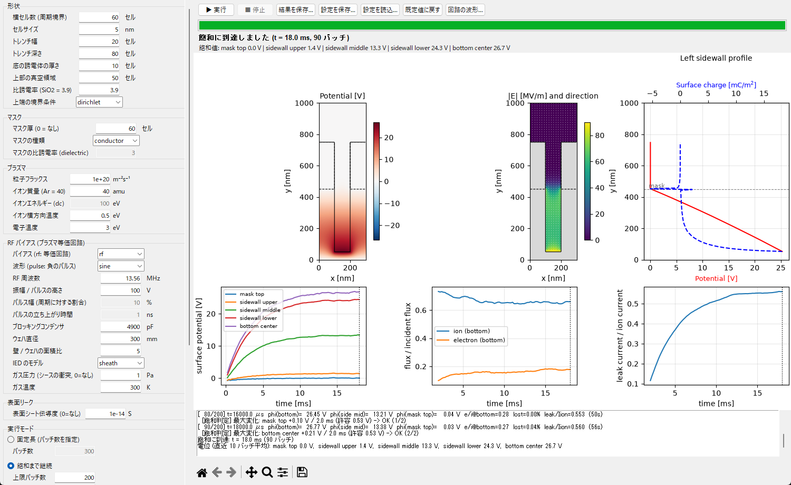
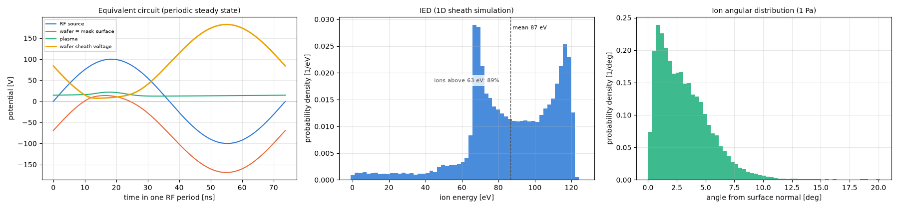
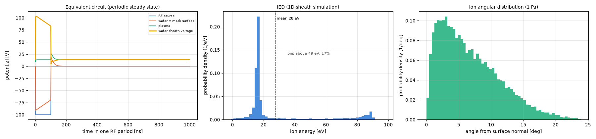
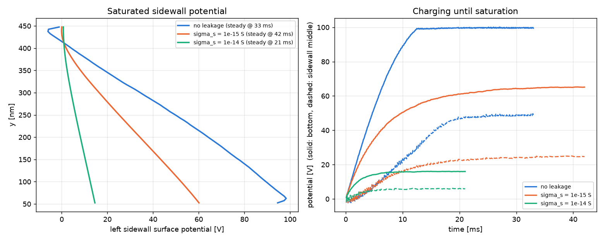
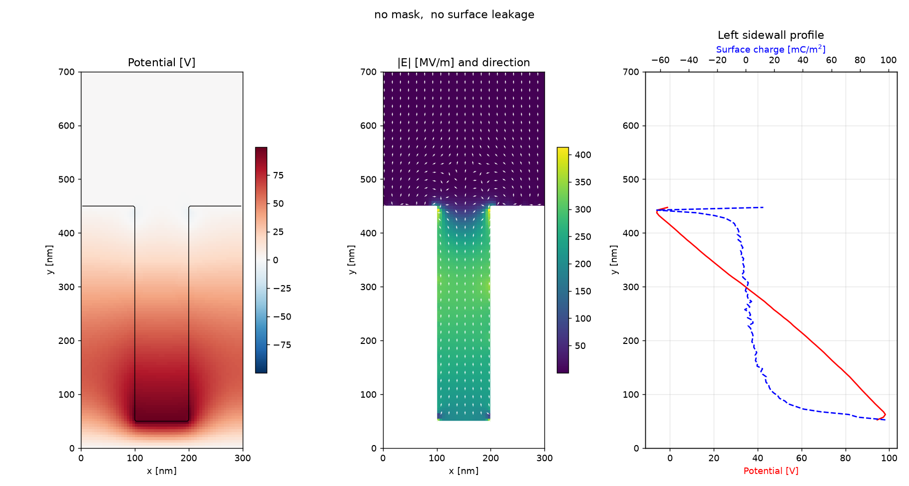

# trench01 — トレンチ構造の表面帯電シミュレーター (2D)

プラズマから飛来する正イオン(高エネルギー・異方的)と電子(低エネルギー・等方的)が、
マスク付き誘電体トレンチの壁面に電荷を溜めていく様子 (electron shading による帯電) を計算する
2D シミュレーターです。マスクは導電性 (doped carbon など) と絶縁性を選べ、表面に沿った電荷のリーク
(表面伝導) も扱えます。イオンのエネルギーと角度の分布は、RF バイアスのプラズマ等価回路と、
ガスとの衝突 (南部–北谷モデル) を含む 1 次元シースの計算から求めます。



## ファイル

| ファイル | 内容 |
|---|---|
| `trench_charging_2d.py` | シミュレーション本体 + コマンドライン実行 |
| `plasma_circuit.py` | RF バイアスのプラズマ等価回路 (シース電圧の波形を求める) |
| `sheath_ied.py` | 1 次元シースの時間発展 (シース電圧の波形からイオンエネルギー分布を作る) |
| `trench_charging_gui.py` | Tkinter + matplotlib の GUI (本体を import して使う) |
| `pyproject.toml`, `uv.lock` | 依存パッケージの定義とバージョン固定 (uv) |

## 必要環境

依存パッケージは [uv](https://docs.astral.sh/uv/) で管理しています。

```bash
uv sync          # .venv を作り、uv.lock のバージョンどおりに numpy / scipy / matplotlib を入れる
```

`uv run` で実行すれば `uv sync` は自動で行われます。Python は 3.9 以上で、`.python-version` で 3.12 を
指定しています (なければ uv が自動で入れます)。GUI には Tkinter が必要です (uv が入れる Python には同梱。
Linux のシステム Python では `sudo apt install python3-tk`)。
パッケージの追加は `uv add <名前>`、更新は `uv lock --upgrade` → `uv sync`。
動作確認: Python 3.12 / numpy 2.5 / scipy 1.18 / matplotlib 3.11

## 使い方

```bash
uv run trench_charging_gui.py                       # GUI
uv run trench_charging_2d.py                        # CLI (既定: 30 ms 分の帯電)
uv run trench_charging_2d.py --until_steady         # 飽和帯電まで継続
uv run trench_charging_2d.py --sigma_s 1e-14        # 表面リークを強くする (シート伝導度 [S], 既定 1e-15, 0 でなし)
uv run trench_charging_2d.py --trench_d 160         # 深さ 160 セル = 800 nm (AR=8)
uv run trench_charging_2d.py --mask_t 40            # マスク厚 40 セル = 200 nm (0 でマスクなし)
uv run trench_charging_2d.py --mask_type dielectric --mask_eps_r 3.0   # 絶縁性のマスク
uv run trench_charging_2d.py --rf_freq 2e6 --rf_volt 150   # RF バイアスの周波数 [Hz] と振幅 [V]
uv run trench_charging_2d.py --rf_wave pulse --rf_freq 1e6 --rf_duty 0.1   # 負の矩形パルス (高さ rf_volt, 幅 10%)
uv run trench_charging_2d.py --bias dc              # RF 回路を使わず、全イオンを ion_energy_eV (100 eV) にする
uv run trench_charging_2d.py --gas_pressure 5       # シース内の衝突のガス圧力 [Pa] (既定 1 Pa, 0 で衝突なし)
uv run trench_charging_2d.py --wall_model absorb    # 壁際の電位障壁を使わず、固体に入った粒子をすべて吸収する
uv run trench_charging_2d.py --no_cache             # 等価回路と IED のキャッシュを使わずに計算し直す
uv run trench_charging_2d.py --help                 # 全パラメータ
```

形状のパラメータ (`trench_w`, `trench_d`, `floor_t`, `mask_t`, `n_vac`) はセル数で指定します
(1 セル = `dx` = 5 nm)。マスクの既定は 厚さ 60 セル = 300 nm の導電性マスクです。

CLI の出力は `<out>_fields.png`, `<out>_history.png`, `<out>.npz` です (RF バイアスなら等価回路の図 `<out>_rf.png` も)。

RF バイアスの等価回路と IED (1 次元シース) の結果は `.cache/circuit/` に保存し、同じ条件なら次からは読み込むだけにします
(1 次元シースは 1 回 5〜40 秒かかるため)。キーは結果に効くパラメーター (回路・プラズマ・ガス・形状) と計算方法の
バージョン (`plasma_circuit.CACHE_VERSION`) のハッシュで、GUI の「回路の波形…」と実行でも共有します。
`.cache/` はフォルダごと消してもかまいません (次の計算で作り直します)。

## モデル

- **構造**: 接地 Si 基板の上の SiO2 (eps_r = 3.9) にマスクを載せ、両方を貫く中央トレンチ。横は周期境界、
  上端は φ=0 (または Neumann)。既定は SiO2 部分が 幅 100 nm × 深さ 400 nm (AR=4)、その上にマスク 300 nm
  (開口は同じ幅で垂直、開口全体の AR=7)、セル 5 nm。
- **マスク** (`mask_type`):
  - `conductor` (既定): doped carbon などの導電性マスク。等電位の浮遊導体として扱い、当たった電荷は導体内を
    自由に動いて、合計の電荷で導体の電位が決まる。導電率が 1e-5 S/m 程度以上 (誘電緩和時間 ε/σ が数 μs 以下) なら
    この扱いでよい (doped carbon は十分これを満たす)。
    導体の緩和時間 (~20 μs) は 1 バッチ (100 μs) より短く、当たった電荷をそのまま足すと電位が 1 バッチごとに
    ±数 V 振動するため、バッチ中の電子電流がボルツマン因子で電位に応答するとして半陰的に更新する
    (定常状態はイオンと電子の電流バランスだけで決まる。dt を 1/5 にした陽解法と ±0.04 V で一致)。
  - `dielectric`: 比誘電率 `mask_eps_r` の絶縁性マスク (表面の扱いは SiO2 と同じ)。
- **粒子**: Monte Carlo テスト粒子。イオンは Ar⁺ で、エネルギーと角度は RF バイアスの等価回路と 1 次元シースから
  求めた分布 (下の「RF バイアス」。`--bias dc` なら全イオン 100 eV で、横方向温度 `ion_temp_eV` 0.5 eV の分だけ傾く)。
  電子は Te=3 eV のマクスウェル分布 (フラックス重み付き)。両者のフラックスは同じ。固体に入る粒子は、表面の電位障壁を
  越えられれば吸収、越えられなければ鏡面反射 (下の「壁際の扱い」)。
- **帯電**: 電場を固定して 1 バッチ分の粒子を追跡 → 壁面セルに電荷を蓄積 → Poisson を解き直す、の繰り返し
  (粒子の通過時間 ≪ 帯電の時定数、という準静的近似)。Poisson は誘電率の調和平均を使った有限差分で、
  行列は固定なので LU 分解を 1 回だけ行う。
- **壁際の扱い** (`wall_model`): 帯電した表面の電位は表面セル (固体) と隣の真空セルの間で大きく変わりますが、
  粒子はセル中心の電場で動くので、この電位差 (障壁) を感じないまま固体セルに入ってしまいます。
  `barrier` (既定) では、粒子が固体セルに入るときに入る面の電位 φ_face = φ_vac + w (φ_solid − φ_vac)
  (誘電体は w = ε_r / (1 + ε_r): Poisson の調和平均と同じ面の電位。導体は w = 1) を求め、面に垂直な運動エネルギーが
  障壁 q (φ_face − φ_vac) より小さければ鏡面反射させ (ステップの初めの位置から法線方向の速度を反転)、越えれば吸収します。
  `absorb` は入った粒子をすべて吸収する、以前の扱いです。
  - 検証: 100 eV のイオンは障壁が 119 V・104 V の面で反射し、96 V の面で吸収される (5 eV の電子も同様)。
    `absorb` は以前の結果とビット単位で一致。
  - 効果: 導電性マスク + 表面リークなしで、境目の SiO2 に正電荷が溜まり続ける現象 (以前は側壁上部が 151 V で未飽和)
    が止まり、91 V で飽和します (下の「結果の例」)。表面リークが小さい導電性マスク (1e-16 S) も早く飽和するようになり
    (300 ms で未飽和 → 45 ms)、そのほかの条件では飽和電位の変化は 3 V 以内です。
- **表面リーク**: 表面セルを抵抗網でつなぎ (シート伝導度 `sigma_s`、既定 1e-15 S)、電位差に応じて表面に沿って電荷を移動。
  後退オイラーで解くので `sigma_s` が大きくても安定で、総電荷は保存される。マスクの表面も同じ `sigma_s` でつなぐ
  (導電性マスクでは、SiO2 表面との境目で電荷が導体に出入りする)。
- **飽和判定** (`--until_steady`): 一定バッチごとのブロック平均電位を前のブロックと比較し、
  全観測点で変化が `max(rtol × 最大電位, 3 × 標準誤差)` 以内の状態が連続したら飽和とみなす。

## RF バイアス (プラズマ等価回路)

Yu et al., *Plasma Sources Sci. Technol.* **31**, 035012 (2022) の等価回路 (Fig. 4(b)) を基に、次の直列回路を
RF 周期定常まで解き (`plasma_circuit.py`)、ウェハ側シース電圧の波形からイオンのエネルギー分布 (IED) と角度分布を
作って、トレンチへのイオンの入射に使います (`--bias rf`、既定)。

```
RF 電源 (正弦波 / 負のパルス) ─ C_b (4900 pF) ─ ウェハ (Si) ─ SiO2 (+ 絶縁性マスク) ─ 表面 (マスク)
    ─ ウェハ側シース ─ プラズマ ─ 壁側シース ─ 接地
```

- 電源の波形 (`rf_wave`) は正弦波 `sine` (既定、振幅 `rf_volt`) か、負に凸の矩形パルス `pulse` です。
  パルスは 0 V から -`rf_volt` へ下がり、幅 (半分の高さで測る) は周期の `rf_duty` 倍 (既定 10%)、
  立ち下がり・立ち上がりは `rf_rise` (既定 1 ns) の直線です。エッジの前後で区切って積分します。
- シースは「イオン電流源 (Bohm フラックス) + 電子のダイオード (ボルツマン因子) + Child 則の非線形容量」の並列です。
  ウェハ (電極) は直径 `wafer_d` (既定 300 mm)、壁側の面積はその `wall_ratio` 倍 (既定 5) です。
- 周期定常では C_b を流れる電流の平均が 0 (各シースでイオン電流と電子電流の平均が釣り合う) になり、
  C_b に直流電圧 (自己バイアス) が溜まります。
- IED (`ied_model`):
  - `sheath` (既定, `sheath_ied.py`): 回路のウェハ側シース電圧 V1(t) を境界条件 (電極 φ = -V1, プラズマ側 φ = 0) にして、
    1 次元のシースを時間発展させます。イオンは粒子 (プラズマ側から Bohm 速度・一定フラックス・面内は温度 `ion_temp_eV`
    の熱速度で注入)、電子はボルツマン分布で、Poisson 方程式を毎ステップ Newton 法で解き、電極に着いたイオンの速度
    (法線と面内) を集めます。ガスとの衝突は南部–北谷モデルで入れます (下の「シース内の衝突」)。
    パルスでシースが一気に広がる動きや、イオンが電圧に追従できるかどうか (周波数とイオンのプラズマ周波数 ~8 MHz の比) を
    そのまま扱えます。トレンチには、集めたイオンの (面内 x, 法線) の速度の組をそのまま入射させます。
    計算は 1 回 5〜40 秒です (結果はキャッシュします)。
  - `transit`: シース電圧をシース通過時間で平均した値 (論文の考え方。一次遅れで近似)。正弦波の 13.56 MHz 以上では
    衝突なしの `sheath` に近い一方、パルスや 2 MHz 前後では大きくずれます。衝突は入りません。
  - `instant`: 瞬時のシース電圧 (論文 式 (5))。十分に低い周波数でだけ正しい。衝突は入りません。
- 帯電の時定数 (ms) は RF 周期 (13.56 MHz で 74 ns) よりずっと長いので、トレンチの計算には IED と角度分布だけを
  渡します (一方向の連成)。電子は、周期平均でイオンと同じフラックスのマクスウェル分布のままです。
- GUI の「回路の波形…」で、今の入力値での波形・IED・角度分布を確認できます (別スレッドで計算)。

既定 (13.56 MHz, 振幅 100 V, C_b 4900 pF, 300 mm ウェハ, 壁/ウェハ = 5, ガス 1 Pa) の周期定常の波形、IED、
イオンの角度分布:



| RF 周波数 | 自己バイアス (ウェハの直流電位) | IED (`sheath`, 1–99%) | 平均イオンエネルギー | 入射角 (99%) | 衝突なし (0 Pa) の IED (平均) |
|---|---|---|---|---|---|
| 60 MHz | -74 V | 7–100 eV | 85 eV | 13° | 86–99 eV (92 eV) |
| 13.56 MHz (既定) | -75 V | 7–121 eV | 87 eV | 13° | 66–120 eV (94 eV) |
| 2 MHz | -55 V | 5–145 eV | 84 eV | 17° | 17–143 eV (88 eV) |
| 400 kHz | -2 V | 4–29 eV | 18 eV | 22° | 13–29 eV (18 eV) |

- 低い周波数では、イオン電流 (300 mm ウェハで 1.1 A) が 1 周期のうちに C_b を大きく充電してしまうため
  自己バイアスが保てず、IED が広がったり下がったりします (論文の charging effect と同じ現象)。
- 2 MHz では、シースの端がイオンと同じくらいの速さで動くので、電圧が高い時間帯に多くのイオンが電極に着き、
  平均エネルギー (衝突なしで 88 eV) が時間平均のシース電圧 (70 eV) より高くなります。`transit` (71 eV) / `instant`
  ではこれが出ません。
- 1 Pa では、13.56 MHz でイオン 1 個あたり平均 0.4 回の電荷交換が起きます (ログに出る衝突の回数 6.1 回は
  ほとんど散乱しない小角の衝突を含み、打ち切り β∞ によって変わります)。シースの途中で電荷交換したイオン (そこから
  加速し直す) が低エネルギー側の裾を作り、平均エネルギーが 3〜8% 下がります。入射角の裾も広がります (13.56 MHz で 99% の角度が
  衝突なしの 9° → 13°。衝突なしの広がりは、注入時のイオン温度 0.5 eV の分です)。表の入射角は法線からの 3 次元の
  角度で、トレンチの 2D 計算に使う面内の角度はこれより小さくなります (13.56 MHz・1 Pa の 99% で 10°)。

負のパルス (高さ 100 V, 幅 10%, 1 MHz) の波形、IED、角度分布:



| パルスの周波数 (幅 10%) | 自己バイアス | シース電圧 | IED (`sheath`, 1–99%) | 平均 | 高エネルギー側のイオン (衝突なし) | 入射角 (99%) |
|---|---|---|---|---|---|---|
| 13.56 MHz | -8 V | 13–103 V | 4–32 eV | 24 eV | (パルスに追従できない) | 19° |
| 1 MHz | -8 V | 5–103 V | 4–90 eV | 28 eV | 18% (18%) | 21° |
| 400 kHz | -6 V | -1–103 V | 4–87 eV | 24 eV | 14% (14%) | 21° |
| 100 kHz | -2 V | -1–103 V | 4–83 eV | 18 eV | 4% (4%) | 22° |

- パルスの間はシース電圧がパルスの高さ + 浮遊電位 (~103 V) まで上がり、残りの時間は浮遊電位 (~14 V) に戻ります。
  IED は「浮遊電位の低いピーク (~16 eV)」と「パルスの高いピーク (~85 eV)」に分かれます
  (高エネルギー側 = IED の最小と最大の中点より上)。
- パルスが始まるとシースが約 1 ns で一気に広がり、その範囲にいたイオンをまとめて加速するので、
  高エネルギー側のイオンはパルス幅 (10%) より多くなります (1 MHz で 18%)。
- 高いピークがパルスの高さ (103 V) より低い 85 eV なのは、イオンが厚いシースを抜けるのに ~100 ns かかる間に、
  イオン電流が C_b を充電してシース電圧が 2.3e8 V/s で下がるためです。周波数が低くパルスが長いほど
  パルスの途中でバイアスが抜け、100 kHz (1 μs) では高エネルギーのイオンが 4% しかありません。
- 13.56 MHz ではパルス (7 ns) がイオンの通過時間 (~70 ns) よりずっと短いので、イオンはパルスに追従できません。
- パルスでは大半のイオンが低いエネルギー (~16 eV) で着くので、注入時のイオン温度だけで角度が広がり
  (衝突なしでも 99% で 20°)、1 Pa の衝突による広がりは 1° ほどです。高エネルギー側の割合も衝突ではほとんど変わりません。

トレンチの帯電への影響 (導電性マスク 300 nm, `sigma_s` 1e-15 S, 飽和まで継続, IED は `sheath`・ガス 1 Pa):

| 電源 | IED 1–99% (平均) | 飽和までの時間 | 底 | 側壁 下部 | 側壁 中腹 | 側壁 上部 | 底 (衝突なし) |
|---|---|---|---|---|---|---|---|
| 正弦波 13.56 MHz・振幅 100 V (既定) | 7–121 eV (87 eV) | 48 ms | 86.3 V | 81.2 V | 52.0 V | 6.9 V | 90.8 V |
| 負のパルス 1 MHz・高さ 100 V・幅 10% | 4–90 eV (28 eV) | 27 ms | 19.3 V | 18.5 V | 14.7 V | 3.2 V | 19.1 V |
| 負のパルス 1 MHz・高さ 200 V・幅 10% | 4–171 eV (53 eV) | 63 ms | 38.1 V | 35.2 V | 22.4 V | 4.1 V | 32.9 V |
| 負のパルス 1 MHz・高さ 100 V・幅 50% | 4–87 eV (39 eV) | 60 ms | 41.8 V | 39.1 V | 25.7 V | 4.7 V | 40.7 V |

幅 10% のパルスでは、イオンの 8 割ほどが浮遊電位程度 (~16 eV) の低いエネルギーなので、底が十数 V になるだけで
それらは追い返され (低いエネルギーのイオンは角度も広がる)、高いエネルギーのイオンと電子が釣り合う所で飽和します。
そのため正弦波より底の電位がずっと低くなります (86 → 19 V)。`sheath` ではパルスの立ち上がりでまとめて加速される
イオンが入るので、`transit` より高エネルギー側が多く、底の電位も高めに出ます。

1 Pa の衝突は、正弦波では 90 eV を超えるイオンを減らして (55 → 47%) 底の電位を下げます (91 → 86 V)。
高さ 200 V のパルスでは逆に底の電位が上がります (33 → 38 V)。シース端より外側の衝突でイオンの横方向の温度
(注入時 0.5 eV) がガスの温度へ冷えて、トレンチに入る角度が狭まり (面内の角度の平均 4.4 → 3.7°)、35 eV を超える
イオンもわずかに増える (32 → 33%) ためです。

回路の検証:
- C_b を流れる電流の周期平均 ≈ 0 (イオン電流 1.1 A に対して 1e-6 A 以下)、各シースで ⟨I_e⟩ / I_i = 1.0000
  (パルスでは、1 周期 4096 点の出力ではエッジ直後の電子電流のスパイクが粗くなり ±2% ずれますが、
  点を増やすと 1.0000 になり、IED は変わりません)。
- シース容量を一定にすると、シース電圧の RF 振幅 (91.1 V) が論文 式 (2) の容量分圧 (89.4 V) と 2% 以内で一致。
- 壁/ウェハの面積比 1 (対称) で自己バイアス 0 V、100 (強い非対称) で -81 V。

1 次元シース (`ied_model=sheath`) の検証:
- シース電圧が一定 (14〜180 V) なら、全イオンのエネルギーが e V1 + Te/2 と 0.03 eV 以内で一致し、
  電極に着くイオンの数が注入した数と一致 (比 1.000〜1.003)。
- 電極の電場から求めたシース厚は、Child 則 (回路のシース容量の式) より 1.6〜1.9 λ_D (110〜125 μm) 厚い
  (シース端の電子が残る遷移領域の分)。
- 400 kHz では `instant` と、60 MHz では `transit` とほぼ同じ IED になる (低い周波数・高い周波数の極限)。
- 衝突なしでは、粒子数・格子間隔・時間刻み・助走時間・集める時間・領域の長さ・乱数を変えても (2 倍や半分)、
  平均エネルギーは 0.03 eV、高エネルギー側の割合は 0.1% 以内で変わらない。1 Pa では、領域の長さを変えると
  平均エネルギーが 1.5% ほど変わる (シース端より外側の、準中性の部分での衝突の分)。

### シース内の衝突 (南部–北谷モデル)

1 次元シースのイオンは、背景ガス (イオンと同じ原子、圧力 `gas_pressure` 既定 1 Pa = 7.5 mTorr、温度 `gas_temp`
既定 300 K のマクスウェル分布) と衝突します。弾性散乱と共鳴電荷交換を、K. Nanbu and Y. Kitatani,
*J. Phys. D: Appl. Phys.* **28**, 324 (1995) のモデルで一緒に扱います (`sheath_ied.py`)。

- 相互作用は分極ポテンシャル −a/r⁴ (Ar の分極率 1.642 ų) です。無次元の衝突パラメーター β = b (E/4a)^(1/4)
  (E: 相対運動のエネルギー) を 0 < β < β∞ から面積に比例して選びます。全断面積が相対速度 g に反比例するので、
  衝突の確率は速度によらず一定です。
- β < 1 は捕獲で、重心系で等方に散乱します。β > 1 は分極ポテンシャルの厳密な偏向角 χ(β) (楕円積分) で散乱します。
- β < β_ex = max(1, A E^(1/4)) (A = 2.6 eV^-1/4, E [eV]) なら確率 1/2 で電荷交換し、イオンはガス原子の
  (散乱後の) 速度を持ちます。電荷交換の断面積は π b_ex² / 2 = 7.3e-19 m² で、E > 22 meV では一定です。
- 打ち切り β∞ は 3 以上で、シース電圧の最大値から見積もった相対エネルギーの上限で β∞ > β_ex になるように選びます
  (13.56 MHz・100 V で 8.5)。β∞ が β_ex より小さいと電荷交換が欠けるためで、そうなった衝突の数はログに出ます
  (ここまでの条件ではすべて 0)。
- `--gas_pressure 0` で衝突なしにすると、衝突を入れる前とまったく同じ IED になります。
- シース端より外側 (準中性の部分) でも衝突するので、注入時のイオンの横方向の温度 (`ion_temp_eV` 0.5 eV) は
  ガスの温度へ近づきます。そのため入射角の平均はかえって狭まり、裾 (99%) はシース内の弾性散乱で広がります。

検証: 一様な電場の中の Ar⁺ (Ar 中, 300 K) のドリフト速度を、論文のモーメント理論 (式 (19)(20)(22)) と比べました
(論文 Fig. 1 と同じ比較)。

| E/N | 100 Td | 300 Td | 1000 Td | 3000 Td | 10000 Td |
|---|---|---|---|---|---|
| モーメント理論 | 340 m/s | 696 m/s | 1346 m/s | 2370 m/s | 4353 m/s |
| このモデル (β∞ = 15) | 337 m/s (-1%) | 707 m/s (+2%) | 1401 m/s (+4%) | 2486 m/s (+5%) | 4583 m/s (+5%) |
| このモデル (β∞ = 3 に固定) | 339 m/s | 708 m/s | 1409 m/s | 2879 m/s | 8208 m/s |

- β∞ = 3 に固定すると、高い E/N で β_ex > β∞ になって電荷交換が欠け、ドリフト速度が大きくなりすぎます
  (論文 Fig. 1 と同じ傾向)。シースの計算では上のように β∞ を選ぶので、この打ち切りは起きません。
- 10〜30 Td ではドリフト速度が熱速度 (~250 m/s) よりずっと小さく、この長さの計算では統計誤差が大きくなります
  (10 Td で ±15% 程度)。

## 結果の例 (飽和まで継続)

SiO2 トレンチ (幅 100 nm × 深さ 400 nm) の上にマスク 300 nm を載せた場合と、マスクなし (`--mask_t 0`) の比較です。
イオンは単一エネルギー 100 eV (`--bias dc`)、ほかのパラメータは既定値。電位は直近 30 バッチ (3 ms) の平均、側壁は左側壁の SiO2 部分
(上部 = SiO2 上面の 20 nm 下) で、マスクなしの「マスク上面」は SiO2 の上面です。

| マスク | 表面シート伝導度 | 飽和までの時間 | 底 | 側壁 下部 | 側壁 中腹 | 側壁 上部 | マスク上面 |
|---|---|---|---|---|---|---|---|
| なし | 0 | 33 ms | 99.7 V | 97.5 V | 48.9 V | -5.1 V | 0.6 V |
| なし | 1e-15 S | 42 ms | 65.1 V | 57.8 V | 24.8 V | 0.0 V | 0.6 V |
| なし | 1e-14 S | 21 ms | 16.0 V | 13.9 V | 6.0 V | 0.7 V | 0.7 V |
| 絶縁性 (εr = 3.0) | 0 | 27 ms | 100.2 V | 101.4 V | 86.0 V | 60.9 V | 1.8 V |
| 絶縁性 (εr = 3.0) | 1e-15 S | 45 ms | 99.8 V | 96.5 V | 72.5 V | 43.7 V | 0.5 V |
| 絶縁性 (εr = 3.0) | 1e-14 S | 33 ms | 28.4 V | 26.5 V | 19.1 V | 11.4 V | 1.1 V |
| 導電性 | 0 | 150 ms ※ | 99.9 V | 100.0 V | 100.2 V | 91.1 V ※ | -0.1 V |
| 導電性 | 1e-16 S | 45 ms | 99.9 V | 98.7 V | 69.8 V | 20.0 V | -0.5 V |
| 導電性 | 1e-15 S | 39 ms | 99.9 V | 95.7 V | 61.1 V | 7.7 V | -0.1 V |
| 導電性 | 1e-14 S | 24 ms | 23.9 V | 21.7 V | 12.0 V | 1.4 V | 0.1 V |

- マスクで開口が深くなる (AR 4 → 7) と electron shading が強まり、側壁がより高い電位まで帯電します
  (リークなしの側壁中腹: マスクなし 49 V → 絶縁性マスク 86 V)。リークなしでは底の電位がイオン入射エネルギー
  (100 eV) で頭打ちになります。
- 導電性マスクはマスク自身の帯電をなくし (電位 ≈ 0 V)、SiO2 側壁の上部の電荷も導体へ逃がすので、
  絶縁性マスクより側壁の帯電が小さくなります (1e-15 S で側壁上部 43.7 → 7.7 V、中腹 72.5 → 61.1 V)。
- ※ 導電性マスクで表面リークなしだと、マスクと SiO2 の境目のすぐ下の SiO2 表面に正電荷が集中します。
  この表面はすぐ隣の導体と小さなコンデンサーを作るので電位が上がりにくく、イオンを受け取り続けるためです。
  以前の扱い (`--wall_model absorb`) では電位がイオンのエネルギーを超えてもイオンが吸収され、電荷が溜まり続けました
  (216 ms で 151 V)。電位障壁 (`barrier`) ではイオンが跳ね返されるので 91 V で止まり、その後は側壁全体が ~100 V まで
  帯電して 150 ms で飽和します。それでも境目の表面電荷 0.7 C/m²・電場 5e9 V/m は SiO2 の絶縁破壊 (~1e9 V/m) を
  超える非物理的な値で、現実には表面伝導や絶縁破壊で抑えられます。導電性マスクは `sigma_s > 0` と組み合わせて
  使ってください (境目の電位は 1e-16 S で 20 V、1e-15 S で 8 V。領域内の最大の電場は 1e-16 S で 1e9 V/m、
  1e-15 S ではマスクなしと同じ程度の 4e8 V/m)。

RF バイアス (既定: 13.56 MHz・100 V, IED は `sheath`・ガス 1 Pa で 7–121 eV, 平均 87 eV) での結果:

| マスク | 表面シート伝導度 | 飽和までの時間 | 底 | 側壁 下部 | 側壁 中腹 | 側壁 上部 | 底 (dc 100 eV) |
|---|---|---|---|---|---|---|---|
| なし | 1e-15 S | 36 ms | 57.4 V | 51.5 V | 22.6 V | -0.3 V | 65.1 V |
| 絶縁性 (εr = 3.0) | 1e-15 S | 36 ms | 77.8 V | 74.5 V | 56.3 V | 34.4 V | 99.8 V |
| 導電性 | 1e-15 S | 48 ms | 86.3 V | 81.2 V | 52.0 V | 6.9 V | 99.9 V |
| 導電性 | 1e-14 S | 33 ms | 23.9 V | 21.7 V | 12.0 V | 1.4 V | 23.9 V |

- IED に幅があるので、低いエネルギーのイオンから先に追い返され、強く帯電する条件
  (dc で底が 100 V 近くまで上がる条件) ほど飽和電位が下がります (底 100 → 78〜86 V)。
- 表面リークが強い (1e-14 S) と、底の電位はリークで決まり、IED にはほとんどよりません。

マスクなしで表面リークを変えたときの比較 (左: 飽和時の側壁の電位分布、右: 帯電の時間変化):



マスクなし・リークなし・飽和時の電位と電場 (左: 電位、中: 電場、右: 左側壁の表面電位と表面電荷):



## 単純化している点

- 表面での粒子の反射 (電位障壁を越えて表面に届いた粒子は必ず吸収)、電子の二次放出、トレンチ内の衝突は
  入れていません。
- リークは表面に沿った伝導のみです。誘電体を貫く膜厚方向のリーク (トンネル電流など) は未実装です。
- 導電性マスクの導電率は無限大 (完全な等電位) とし、基板とはつながっていない (浮遊) としています。
  マスクの開口はトレンチと同じ幅の垂直な側壁です (テーパーやマスクのエッチングによる後退は未実装)。
- 等価回路は論文の従来型 (Fig. 4(b)) 相当です。改良型 (Fig. 5) のプラズマ抵抗 R_p、テーブルの露出部のシース、
  寄生容量 C_t、浮遊インダクタンス L_s は入れていません。RF との連成は一方向 (IED のみ) で、
  シース崩壊時の電子の指向性 (電場の反転) も入れていません。
- シースの衝突は、イオンと同じ原子の背景ガスとの弾性散乱と共鳴電荷交換だけです。分極率と電荷交換の係数 A は
  Ar の値なので、`ion_mass_amu` を変えても衝突のパラメーターは Ar のままです。電子の衝突 (電離など) は入れておらず、
  電子はボルツマン分布のままです。衝突は 1 次元シースの中だけで、回路 (シース容量・Bohm フラックス) には入れていません。
- 回路のシース容量 (Child 則) は 1 次元シースより 15% ほど薄いシースに相当しますが、回路はそのままにしています。
- 2D (奥行き方向は一様) です。1 次元シースで求めたイオンの面内速度 (x, z) のうち、トレンチには x だけを使います
  (z は捨てる)。
- 図のラベルは、日本語フォントがない環境でも文字化けしないよう英語にしています。

## 注意

- 1 マクロ粒子が運ぶ電荷が大きいため、個々の表面セルの電位にはショットノイズが乗ります
  (空間的に滑らかな電位分布や飽和値には影響しにくい)。粒子数 (`--n_per_batch`) を増やすと小さくなります。
- 時間刻み `--dt_batch` を大きくしすぎると電位が振動します。
- 導電性マスクを表面リークなし (`sigma_s=0`) で使うと、マスクと SiO2 の境目に正電荷が集中して非物理的に強い電場になり、
  飽和にも 150 ms ほどかかります (`absorb` では溜まり続けます。結果の例の ※)。ログにも注意が出ます。
- `plasma_circuit.py` / `sheath_ied.py` の計算方法を変えたら、`plasma_circuit.CACHE_VERSION` を上げてください
  (古いキャッシュを読まないように。`.cache/` を消しても同じです)。
