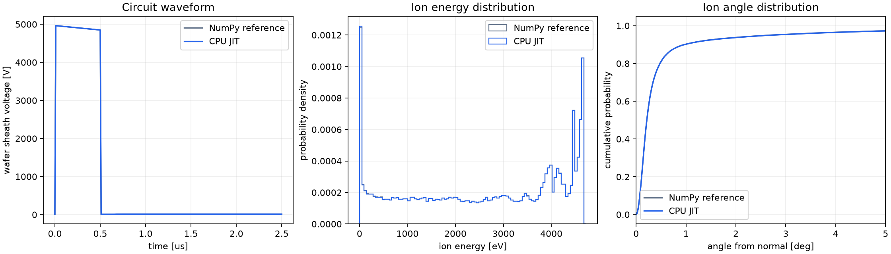
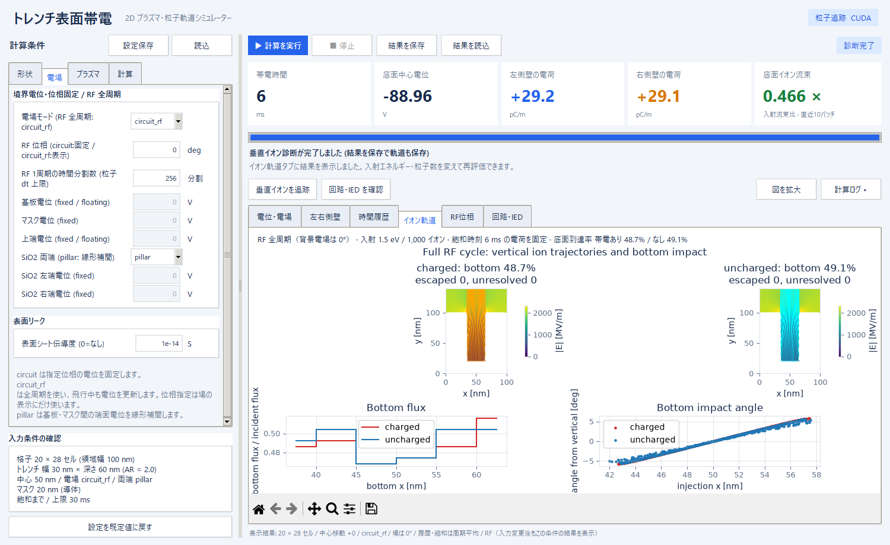
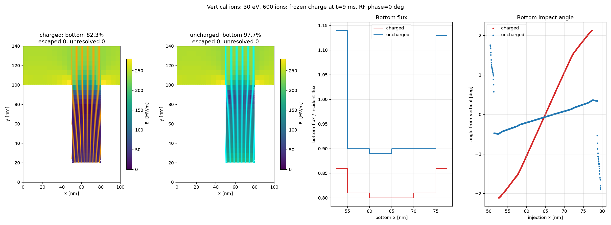

# trench01 — トレンチ構造の表面帯電シミュレーター (2D)

プラズマから飛来する正イオン(高エネルギー・異方的)と電子(低エネルギー・等方的)が、
マスク付き誘電体トレンチの壁面に電荷を溜めていく様子 (electron shading による帯電) を計算する
2D シミュレーターです。マスクは導電性 (doped carbon など) と絶縁性を選べ、表面に沿った電荷のリーク
(表面伝導) も扱えます。イオンのエネルギーと角度の分布は、RF バイアスのプラズマ等価回路と、
ガスとの衝突 (南部–北谷モデル) を含む 1 次元シースの計算から求めます。


## ファイル

| ファイル | 内容 |
|---|---|
| `trench_charging_2d.py` | シミュレーション本体 + コマンドライン実行 |
| `plasma_circuit.py` | RF バイアスのプラズマ等価回路 (シース電圧の波形を求める) |
| `sheath_ied.py` | 1 次元シースの時間発展 (シース電圧の波形からイオンエネルギー分布を作る) |
| `sheath_fast.py` | 倍精度・同じ分解能の CPU JIT シース計算 |
| `trench_cuda.py`, `trench_trace.cu` | CUDA 粒子追跡器と、移動・壁反射・軌道記録の GPU カーネル |
| `benchmark_cuda.py` | 同じ条件での CPU/CUDA の実行時間と計算結果の比較 |
| `benchmark_circuit.py` | 設定 JSON を使った等価回路・IED の時間と分布の比較 |
| `trench_charging_gui.py` | Tkinter + matplotlib の GUI (本体を import して使う) |
| `tests/` | 回帰テストと基準データ (`tests/data/*.npz`) |
| `pyproject.toml`, `uv.lock` | 依存パッケージの定義とバージョン固定 (uv) |

## 必要環境

依存パッケージは [uv](https://docs.astral.sh/uv/) で管理しています。

```bash
uv sync          # .venv を作り、uv.lock のバージョンどおりに numpy / scipy / matplotlib (と開発用の pytest) を入れる
```

`uv run` で実行すれば `uv sync` は自動で行われます。Python は 3.9 以上で、`.python-version` で 3.12 を
指定しています (なければ uv が自動で入れます)。GUI には Tkinter が必要です (uv が入れる Python には同梱。
Linux のシステム Python では `sudo apt install python3-tk`)。
パッケージの追加は `uv add <名前>`、更新は `uv lock --upgrade` → `uv sync`。
動作確認: Python 3.12 / numpy 2.5 / scipy 1.18 / matplotlib 3.11

## 使い方

```bash
uv run trench_charging_gui.py                       # GUI
uv run trench_charging_2d.py                        # CLI (既定: 30 ms 分の帯電)
uv run trench_charging_2d.py --until_steady         # 飽和帯電まで継続
uv run trench_charging_2d.py --sigma_s 1e-14        # 表面リークを強くする (シート伝導度 [S], 既定 1e-15, 0 でなし)
uv run trench_charging_2d.py --trench_d 160         # 深さ 160 セル = 800 nm (AR=8)
uv run trench_charging_2d.py --mask_t 40            # マスク厚 40 セル = 200 nm (0 でマスクなし)
uv run trench_charging_2d.py --trench_taper_deg 2 --mask_taper_deg 5  # トレンチ・マスクのテーパー角 [deg]
uv run trench_charging_2d.py --mask_type dielectric --mask_eps_r 3.0   # 絶縁性のマスク
uv run trench_charging_2d.py --rf_freq 2e6 --rf_volt 150   # RF バイアスの周波数 [Hz] と振幅 [V]
uv run trench_charging_2d.py --rf_wave pulse --rf_freq 1e6 --rf_duty 0.1   # 負の矩形パルス (高さ rf_volt, 幅 10%)
uv run trench_charging_2d.py --bias dc              # RF 回路を使わず、全イオンを ion_energy_eV (100 eV) にする
uv run trench_charging_2d.py --gas_pressure 5       # シース内の衝突のガス圧力 [Pa] (既定 1 Pa, 0 で衝突なし)
uv run trench_charging_2d.py --wall_model absorb    # 壁際の電位障壁を使わず、固体に入った粒子をすべて吸収する
uv run trench_charging_2d.py --no_cache             # 等価回路と IED のキャッシュを使わずに計算し直す
uv run trench_charging_2d.py --help                 # 全パラメータ
```

### トレンチ・マスクのテーパー

GUI の「形状」で、トレンチとマスクそれぞれのテーパー角を指定できます。
角度は**鉛直からの角度**です。0° は従来の垂直壁、正は下ほど開口が狭い形状、負は下ほど広い逆テーパーです。
左右の角度は対称で、`trench_offset` による中心移動と併用できます。

`trench_w` は **SiO2 上面（マスク下面）の開口幅**です。マスクとトレンチをこの面でつなぎ、
トレンチ底幅は `trench_w - 2 * trench_d * tan(trench_taper_deg)`、
マスク入口幅は `trench_w + 2 * mask_t * tan(mask_taper_deg)` とします（幅・深さ・厚さはセル数、角度は度）。
表示するアスペクト比 AR は、SiO2 上面の幅を基準にした値です。
`mask_t=0` ではマスク角は形状に影響しません。開口幅が1セル未満になる、または左右に1セルの固体を
残せない指定は、計算前に入力エラーとして表示します。

プレビューには設計上の底・入口幅と、格子で再現した幅を併記します。
計算は既存の直交格子を使い、セル中心の位置で固体・真空を判定した**階段状のテーパー**です。
電場・粒子衝突・反射・リークはこの格子形状に従い、反射の法線も実際に横切る格子面の法線です。
滑らかな斜面の法線を直接使うモデルではありません。細かな角度差や軌道の評価には、セルサイズを小さくし、
同じ物理寸法を保つようセル数を増やして格子依存性を確認してください。
左右の電荷ログ・飽和判定・側壁プロファイルは段差部分を含みます。表示する面電荷密度は従来どおり
セル電荷を `dx` で割った換算値です。

帯電計算の底面流束比は、実際の格子底幅で平均した流束を入射流束で割った値です。
垂直イオン診断はマスク上面（マスクなしならSiO2上面）の格子開口に一様に入射し、底面到達率・流束・軌道を
帯電あり／なしで比較します。流束の重みには入口幅、底面プロットには底幅を使うため、テーパーの遮蔽も反映します。
角度は設定JSON・結果NPZに保存されます。旧ファイルでは0°を適用します。
保存結果から続ける場合は元の角度を引き継ぎ、角度を変える場合は新しい計算として実行してください。

設定画面の例: [テーパーのプレビュー](docs/gui_taper.png)。
形状・遮蔽・電荷保存・角での衝突・RF・再開・GUIのテストに加え、
既存結果との0°での照合、および指定設定に2°/5°を加えたCPU/CUDAの比較を実施しています。
条件と数値の照合結果は [docs/taper_validation.json](docs/taper_validation.json) に保存しています。

### GUI ダッシュボード

左の設定パネルは「形状」「電場」「プラズマ」「計算」の 4 タブです。
実行前は入力形状をプレビューでき、不正な入力は「入力条件の確認」に表示されます。
「計算」で固定長 / 飽和まで継続、CPU / CUDA、垂直イオン診断の条件を選びます。

上部には帯電時間、底面中心電位、左右 SiO2 側壁の蓄積電荷、底面イオン流束比を表示します。
流束比は直近 10 バッチ（10 未満なら全バッチ）の平均です。

| 結果タブ | 内容 |
|---|---|
| 電位・電場 | 電位マップ、電場強度と方向 |
| 左右側壁 | 左右の電位・面電荷密度、SiO2 側壁電荷の時間履歴（左は青、右は橙） |
| 時間履歴 | 観測点の電位、底面のイオン / 電子流束、表面リーク |
| イオン軌道 | 飽和電荷による垂直ビームの軌道、底面流束、入射角の比較 |
| 回路・IED | RF 回路の波形、イオンエネルギー分布、シースモデルでの角度分布 |

「図を拡大」で選択中の図を別ウィンドウに開き、ズーム・保存できます。
拡大図は開いた時点の表示です。リアルタイム更新はダッシュボード内で行います。
「計算ログ」でログを開閉でき、左右のパネル幅は境界をドラッグして変更できます。
結果を表示した後に入力を編集しても、図は元の計算条件を保持します。表示条件は画面下部に示します。
「結果を読込」で NPZ に含まれる回路やイオン診断も専用タブに復元します。

### 保存結果から続きの計算

GUI では、表示中の計算結果に対して「続きから計算」を押します。
保存済みの結果を使う場合は「結果を読込」で **NPZ** を開き、「計算」タブで計算量を設定してから再開します。

| 実行モード | 再開時のバッチ数 |
|---|---|
| 固定長 | 指定数を追加する。300バッチの結果に100を指定すると通算400バッチになる |
| 飽和まで継続 | 上限は通算バッチ数。上限到達済みなら現在のバッチ数より大きい値に変更する |

蓄積電荷・電位・表面リーク・時間履歴・左右の電荷ログを引き継ぎます。
RF 回路の波形と入射分布も保存済みのデータを再利用します。
形状・物理条件・粒子条件は保存結果と同じものを使用し、変更された場合は入力エラーとして表示します。
実行モード、計算量、飽和判定の設定、CPU/CUDA、診断用の粒子数・エネルギーは変更できます。
`circuit_rf` の表示位相も変更でき、粒子計算は引き続き全周期を使います。
停止した計算も同じ手順で再開できます。

CLI では `--resume_result` を使います。指定しない設定は NPZ の保存条件を引き継ぎます。

```bash
# 100バッチ追加する（保存時のモードにかかわらず固定長になる）
uv run --extra cuda trench_charging_2d.py --resume_result charged.npz --n_batches 100

# 飽和判定をしながら通算5000バッチまで続ける
uv run --extra cuda trench_charging_2d.py --resume_result charged.npz --until_steady --max_batches 5000
```

保存先を省略すると `charged_continued.npz` と対応する図を作成します。
`--out` で保存先を変更できます。`--load_result` は保存電荷からの診断用、`--resume_result` は帯電計算の再開用です。

新たな NPZ には入射粒子・RF 入射位相の乱数状態と飽和判定の連続 OK 回数も保存します。
同じ設定・計算方式・実行環境では、連続して計算した結果と分割して再開した結果を照合しています。
設定と内部電荷を含み、乱数状態のない既存 NPZ も、保存条件に従って入射抽出のみを再実行して乱数の続きへ進めます。
旧結果にない電荷観測履歴は未計測として扱い、
再開後に必要な2ブロック分の履歴が揃ってから電位・電荷の飽和判定を行います。
飽和判定の設定を変えた場合は連続 OK 回数をリセットします。
再開して電荷が変わった後の垂直イオン診断は、新たに飽和した電荷から実行します。

検証では `お試し/50シフト/trench_charging.npz` の309 msからCUDAで30バッチだけを追跡し、
312 msまでの連続計算と電荷・電位・電場・履歴が完全に一致しました。
条件と結果は [検証記録](docs/resume_validation.json) に保存しています。

### CUDA による高速化

CPU (既定) と CUDA を GUI の「計算 → 粒子追跡・数値設定 → 粒子追跡」、または CLI の `--backend` で選べます。
帯電計算と、飽和後の垂直イオン診断のどちらにも適用されます。

| `backend` | 動作 |
|---|---|
| `cpu` | 従来の NumPy による追跡。CUDA は不要 |
| `cuda` | CUDA 必須。依存関係・GPU・初期化の問題があれば理由を表示して停止 |
| `auto` | CUDA 初期化に成功した場合は GPU を使用し、利用できなければ理由をログに出して CPU を使用 |

必要環境は NVIDIA GPU、対応ドライバ、CUDA Toolkit 13.x、Python 3.10 以上です。
CuPy は任意の依存として `pyproject.toml` と `uv.lock` に追加しているので、CPU 専用環境ではインストール不要です。
Toolkit が未導入の環境では、[CuPy の公式インストール手順](https://docs.cupy.dev/en/stable/install.html)を参照してください。
このリポジトリの `cuda` extra は Toolkit 自体をインストールしません。

```bash
uv sync --extra cuda
uv run --extra cuda trench_charging_gui.py
# GUI の「計算 → 粒子追跡・数値設定 → 粒子追跡」を cuda にする (既定は cpu)

uv run --extra cuda trench_charging_2d.py --backend cuda
uv run --extra cuda trench_charging_2d.py --backend cuda --vertical_probe --probe_ions 10000
uv run --extra cuda trench_charging_2d.py --backend cuda --load_result charged.npz --vertical_probe
uv run trench_charging_2d.py --backend auto
```

GPU が複数あれば `--cuda_device 1` などで番号を指定します。実際に使った GPU 名・計算方式をログに出し、
NPZ に `backend_used` を保存します。CPU で計算した飽和結果から CUDA で診断することも、その逆もできます。

GPU 化したのは、標準形状のプロファイルで約95%の時間を占めた**粒子追跡**です。
1 粒子を 1 CUDA thread に割り当て、電場の補間、CFL による移動、周期境界、壁面での吸収・障壁による反射を
カーネル内でまとめて処理します。256 ステップごとに追跡中の粒子を確認し、診断の停止要求にも対応します。
診断軌道は指定された粒子だけを GPU 上で記録します。乱数と入射条件は CPU 版と共通で、
倍精度 (`float64`) を使い、FMA による演算の融合を無効にしています。

Poisson の疎行列 LU、表面リーク、等価回路・1 次元シース、描画は CPU で実行します。
1 次元シースは下記の CPU JIT で高速化しています。`backend` はトレンチ内の粒子追跡方式を指定します。
GPU と CPU の演算には環境依存の丸め差があるため、あらゆる条件でのビット一致は保証しません。
同じ入射粒子で衝突数・軌道・電荷・電位を照合する CUDA テストを追加しています。

RTX 5070 Ti / CUDA Toolkit 13.0 / CuPy 14.2.0 での実測は、標準形状、DC、3000 粒子/種/バッチ、
20 バッチ、3 回反復の中央値で **CPU 6.045 秒 → CUDA 0.526 秒 (約11.5倍)** でした。
初回の CUDA 初期化・コンパイルと図の描画を除き、Poisson・リークの準備を含む帯電計算全体を測っています。
この条件では最終電位の差は 0 V でした。速度と丸め差は形状・粒子数・追跡ステップ数・GPU・実行環境で変わります。
計測の全条件と各回の時間は [docs/cuda_benchmark.json](docs/cuda_benchmark.json) に保存しています。

```bash
uv run --extra cuda python benchmark_cuda.py --n_batches 20 --repeats 3
uv run --extra cuda python benchmark_cuda.py --n_per_batch 10000 --json benchmark.json
uv run --extra cuda pytest tests/test_cuda.py tests/test_features.py
```

初回は CUDA コンテキストの作成とカーネルのコンパイルに時間がかかります。
コンパイル結果は `.cache/cupy/` に保存して再利用します (`CUPY_CACHE_DIR` を指定した場合はそちらを尊重します)。
CUDA を導入していない環境のテストでは GPU が必要なケースだけをスキップし、CPU とフォールバックのテストは実行します。

### 等価回路・IED の高速化

`field_mode=circuit` と `circuit_rf` の帯電計算は、**回路の電位波形だけ**を計算します。
このモードの入射条件は Te/2 で、1 次元シースの IED を使用しないため、不要なシース計算を省きます。
入射分布を使う通常の RF モードと、GUI の「回路・IED を確認」は IED まで計算します。
計算した回路波形は「回路・IED」タブや保存図に表示され、未計算の IED はその旨を表示します。
波形のみのキャッシュを IED 計算に流用することはありません。完全なキャッシュは両方の要求に再利用できます。

1 次元シースは NumPy の参照実装から CPU JIT に切り替えました。
Numba は通常依存として uv で管理しており、Python 3.10 以上では自動的に使用します。
CUDA は不要です。初回は機械語へのコンパイル時間が追加され、その後はディスクのコンパイルキャッシュを使います。
Numba の対応バージョンは[公式の互換性表](https://numba.readthedocs.io/en/stable/user/installing.html#version-support-information)に従い、NumPy 2.5 に対応する版を使用しています。
Python 3.9 など Numba を利用できない環境では NumPy 版を使用します。ログに計算方式と分解能を表示します。

倍精度、200 粒子/セル、格子間隔、0.25 ns の時間刻み、Newton 法の許容値・反復上限は維持しています。
粒子配列を再利用し、三重対角行列は Thomas 法、散乱の完全楕円積分は算術幾何平均で解きます。
乱数生成器を並列に共有せず、`fastmath` による精度低下も使用しません。
衝突を含む長い追跡では丸め差が粒子の到達ステップを変え、以後の乱数消費が変わる場合があるため、分布で比較します。

指定の `お試し/trench_settings.json` (400 kHz / 5 kV / 負のパルス / 幅20% / 立ち上がり10 ns / 1 Pa) での実測:

| 処理 | 高速化前 | 高速化後 |
|---|---:|---:|
| 瞬時電場用の回路準備 | 190.203 秒（使用しない IED も計算） | **0.100 秒（回路波形のみ）** |
| 回路＋1次元シース IED | 190.203 秒 | **24.449 秒（約7.78倍）** |

いずれも結果キャッシュを使わずに測定しました。参照版は1回、JIT版はウォーム実行2回の中央値です。
JIT版のプロセス内初回は25.639秒で、既存のコンパイルキャッシュを利用しています。
シース格子は1,254セル、初期粒子は250,800個、18,000ステップで、回路波形は差0 Vでした。
IED平均は2583.167 → 2582.597 eV（差0.0221%）、累積エネルギー分布の最大差は0.0986パーセントポイントです。
全条件・時間・速度と角度の分布は [docs/circuit_benchmark.json](docs/circuit_benchmark.json) に保存しています。



```bash
uv run --extra cuda python benchmark_circuit.py --config "お試し/trench_settings.json" --repeats 2
uv run --extra cuda pytest tests/test_circuit_fast.py
```

比較用には `plasma_circuit.solve_circuit(p, sheath_engine="numpy")` を使えます。
初回コード変更後は新しい版の結果キャッシュを作ります。設定 JSON の値を変更する必要はありません。

形状のパラメータ (`trench_w`, `trench_d`, `floor_t`, `mask_t`, `n_vac`) はセル数で指定します
(1 セル = `dx` = 5 nm)。マスクの既定は 厚さ 60 セル = 300 nm の導電性マスクです。

CLI の出力は `<out>_fields.png`, `<out>_history.png`, `<out>.npz` です (RF バイアスなら等価回路の図 `<out>_rf.png` も)。
左右の SiO2 側壁の積分電荷履歴を `<out>_charge.png` に、垂直イオン診断を実行した場合は
電場・軌道・底フラックス・偏向角を `<out>_ions.png` に保存します。

### トレンチ位置と外部電位

GUI の「形状」で中心の移動量をセル数で指定できます。`trench_offset` は正なら右、負なら左です。
移動後も左右に少なくとも 1 セルの固体が必要です。中心座標は
`((nx - trench_w) // 2 + trench_offset + trench_w / 2) * dx` です。

「境界電位・位相固定 / RF 全周期」の電場モードは次の 4 種類です。

| `field_mode` | 基板・マスクの扱い |
|---|---|
| `floating` (既定) | 従来の浮遊導電性マスク。基板は `substrate_voltage` (既定 0 V)、上端は `top_voltage` (既定 0 V) |
| `fixed` | 基板を `substrate_voltage`、導電性マスクを `mask_voltage`、上端を `top_voltage` に固定 |
| `circuit` | RF 等価回路の `uw` (基板)、`um` (マスク) を `rf_phase` [deg] で周期補間し適用 |
| `circuit_rf` | RF 全周期の入射を追跡し、飛行時間に応じて基板・マスク・ピラーの電位を更新 |

`circuit` ではプラズマ電位 `up` を基準の 0 V とし、基板に `uw - up`、マスクに `um - up`、上端に 0 V を与えます。
指定位相の電場を凍結する準静的な計算です。バッチ中に RF 波形を時間発展させる方式ではありません。
`bias=rf` と `top_bc=dirichlet` が必要です。外部電位を与えるマスクは `conductor` にしてください。
電位固定の導体に入った電荷は電源へ逃げ、表面の誘導電荷を表示・保存します。

回路電位モードでは、上端をプラズマ電位に置くため、イオンを Bohm エネルギー `electron_temp_eV / 2` で入射し、
領域内の電場で加速します。加速済みの周期平均 IED を重ねて適用しません。イオンの横方向熱速度は従来どおり加えます。
**上部真空領域をシース長の代わりに使う近似**であり、実際の巨視的なシースの長さ・空間電荷・ガス衝突は
この 2D 回路電場には含みません。`circuit_rf` の飛行中の RF 履歴も、この計算領域内のものです。
従来の 1 次元シースから得た IED/IAD を使う計算は `floating` または `fixed` で実行できます。

#### RF 周期全体を使うモード

GUI の「電場 → 電場モード」で **`circuit_rf`** を選びます。`bias=rf`、上端 `dirichlet`、
マスクありなら `conductor` が必要です。既存設定 JSON は従来の `circuit` を維持するため、読み込んだ後に切り替えてください。

各バッチでイオン・電子の入射時刻を 0–360° の全周期に分散させます。1 周期を粒子数で等分し、各区間内の時刻を乱数で選び、
入射位置・速度との相関を避けるため順序を混ぜます。粒子はそれぞれ時計を持ち、飛行中にも基板の `uw(t)-up(t)` と
マスクの `um(t)-up(t)` を周期補間します。`pillar` 境界も瞬時の基板・マスク電位に追従します。
壁面の反射障壁にも到達時の瞬時電位を使います。CPU・CUDA の両方に対応しています。

Poisson の線形性を使い、基板 1 V とマスク 1 V の電位・電場応答を準備して重ね合わせるため、
各粒子の時間ステップで Poisson を解き直す必要はありません。時間方向は中点の電圧で加速し、
CFL に加えて `RF 周期 / rf_time_steps`（既定 256 分割）以下に制限します。
パルスの場合は立ち上がり時間の 1/8 以下にも制限します。細かくするには `rf_time_steps` を増やします。
回路波形は従来と同じ 4096 点の周期補間です。

表面帯電は RF より遅いという**周期平均の近似**を使います。表面電荷をバッチ中は固定し、
全位相の粒子付着と周期平均の外部電位による表面リークを合わせてバッチごとに更新します。
`dt_batch` は RF 1 周期以上とします。RF 周期内の表面電荷の細かな振動や、回路への帯電のフィードバックは扱いません。
捕捉粒子を次のバッチへ持ち越す PIC 方式でもありません。`lost` が大きい場合は最大ステップ数を増やし、
粒子数・時間刻み・バッチ時間を変えて結果の収束を確認してください。

**電位履歴は周期平均、電位・電場・側壁の図は `rf_phase` の瞬間の場**です。
飽和判定では周期平均の電位と、各バッチで更新した表面の蓄積電荷を確認します。
このモードの `rf_phase` は表示だけに影響し、帯電結果や入射位相には影響しません。
電位判定の相対許容値は、外部の周期平均電位を差し引いた帯電電位を基準にします（最小スケール 1 V）。
大きな RF バイアス電圧だけで許容値が広がり、早すぎる飽和判定になることを避けています。
NPZ の `phi` は表示位相、`mean_phi` は周期平均電位、`rho_raw` は内部の蓄積電荷を保存します。

```bash
uv run --extra cuda trench_charging_2d.py --field_mode circuit_rf --side_bc pillar --backend cuda --until_steady --out rf_cycle
uv run --extra cuda trench_charging_2d.py --field_mode circuit_rf --rf_time_steps 512 --rf_phase 90 --n_batches 20 --out rf_cycle_90
uv run --extra cuda pytest tests/test_rf_cycle.py
```

正弦波の一様電場に対する粒子運動の解析解、時間刻みを半分にしたときの誤差減少、
任意位相の独立した Poisson 解との一致、瞬時の壁面障壁、CPU/CUDA の軌道、
周期平均の飽和・診断・NPZ 再読込をテストしています。GUI からの計算・診断も含め、関連73テストが通過しました。

指定の `お試し/trench_settings.json` は変更せず、`field_mode` だけ `circuit_rf` にした検証では、
RTX 5070 Ti で3000バッチ（300 ms）の帯電計算を約222.6秒で完了しました（準備を含み、描画・保存は除く）。
この上限では飽和判定を通過していません。終盤の周期平均底面電位は約−867.4 Vで、
最後10バッチの追跡打ち切り率は0%、底イオン流束 / 入射流束は0.03315でした。
飽和後の診断には上限バッチ数を増やす必要があります。全条件・元JSONのSHA256・計測値は
[docs/rf_cycle_validation.json](docs/rf_cycle_validation.json) に記録しています。



SiO2 の左右の外端 (トレンチ側壁とは別) に電位を与える `side_bc` も追加しています。

| `side_bc` | SiO2 左右の外端 |
|---|---|
| `periodic` (既定) | 従来の周期境界 |
| `pillar` | 基板からマスクまでの電位を SiO2 の高さに沿って線形補間。`field_mode=fixed/circuit/circuit_rf` が必要 |
| `fixed` | 左端を `left_voltage`、右端を `right_voltage` に個別固定 |

ピラーは高さ方向の指定電位分布によるモデルです。抵抗やピラー電流の回路連成は扱いません。
等電位の導体ピラーを想定する場合は、基板・マスク・両端に同じ電位を設定してください。
どちらの外端電位モードでも SiO2 内の左右の周期結合を外します。マスク・上部真空の左右は周期境界を保持します。
表面リークには外部電位による電流も含みます。

```bash
uv run trench_charging_2d.py --trench_offset 8
uv run trench_charging_2d.py --bias dc --field_mode fixed --substrate_voltage -30 --mask_voltage -10 --side_bc pillar
uv run trench_charging_2d.py --field_mode circuit --rf_phase 90 --side_bc pillar
uv run trench_charging_2d.py --bias dc --field_mode fixed --side_bc fixed --left_voltage -20 --right_voltage -5
```

### 左右の側壁ログと、飽和後の垂直イオン診断

左右の SiO2 側壁の上・中・下の電位を観測し、飽和判定にも両側を使います。
GUI の「左右側壁」で左右の電位・面電荷密度を重ねて表示し、上部の指標・電荷履歴・`_charge.png` には
SiO2 部分の側壁積分電荷を左右別に表示します。積分電荷の単位は奥行き 1 m あたりの `pC/m` です。
内部の `charge_hist["left"/"right"]` と保存 NPZ の `charge_left/right` は `C/m`、面電荷密度は `rho * dx` [C/m²] です。
左の電位履歴の既存キー `sidewall upper/middle/lower` を維持し、右は `right sidewall upper/middle/lower` を追加しました。

GUI では「計算 → 飽和まで継続」で計算した後、「垂直イオンを追跡」を押します。
「計算 → 飽和後の垂直イオン診断」で粒子数、入射エネルギー、表示する軌道数を設定できます。
保存結果は「結果を読込」から再利用できます。

診断では開口幅に等間隔のイオンを入射し、**全イオンの初期横速度を厳密に 0** にします。
イオンのエネルギーは `probe_energy_eV`、開口へ与えるフラックスは `flux` です。
飽和判定を通過した最後の電荷分布を固定し、同じ外部電位・入射位置・速度で「帯電あり」と
「蓄積電荷なし」を比較します。粒子衝突による追加帯電や表面リークは診断中に進めません。
底フラックスは `flux` に対する比として表示し、底到達率・流出数・最大ステップで打ち切った数も表示します。
軌道は `probe_trajectories` 個だけ保存・表示し、フラックスには `probe_ions` 個すべてを使います。

`circuit` では診断時に RF 位相を変え、同じ飽和電荷を別位相の瞬時電場で評価することもできます。
この場合は帯電分布自体を新しい位相で再び飽和させるわけではありません。
診断エネルギーは診断領域の上端での値なので、回路電位モードでシース入口を想定する場合は
`probe_energy_eV` を `electron_temp_eV / 2` に設定してください。

`circuit_rf` の飽和結果では、垂直イオン診断も全周期を使います。帯電あり・なしで同じ入射位相を使い、
飛行中の RF 電場を更新します。周期平均の底フラックスと軌道に加え、**入射位相別の底到達率・衝突エネルギー**を表示します。
GUI は「イオン軌道」と「RF位相」のタブに分け、保存する `_ions.png` は6パネルでまとめます。
軌道の背景に示す電場は `rf_phase` の瞬間の場で、各軌道が通過中に受ける場は時間変化します。
`probe_ions` は全位相を合わせた粒子数です。粒子ごとの入射位相・終端位相・飛行時間も NPZ に保存します。

```bash
# 飽和まで計算し、自動的に垂直ビームを評価
uv run trench_charging_2d.py --bias dc --vertical_probe --probe_energy_eV 100 --probe_ions 2000 --out charged

# 保存した飽和結果を、50 eV の垂直イオンで再評価
uv run trench_charging_2d.py --load_result charged.npz --vertical_probe --probe_energy_eV 50 --out probe50
```

`--vertical_probe` は新規計算時に「飽和まで継続」を有効にします。上限までに飽和しなければ帯電結果だけ保存し、
診断は実行しません。中断結果も診断対象にしません。新形式の NPZ は設定・内部電荷・履歴・回路波形・診断軌道を
pickle なしで保存します。旧形式には内部電荷と設定がないため、再計算して保存してください。
`--load_result` 時の形状・電位・RF 位相は保存設定を使用し、CLI では診断粒子数・エネルギー・軌道数を変更できます。
`--probe_phase 180` を追加すると、飽和電荷を保持したまま診断だけを別の RF 位相で実行できます。

小さな検証例では、30 eV の垂直イオンの底到達率は帯電あり 82.3%、蓄積電荷なし 97.7% でした。
この例は下記の条件で 90 バッチ (9 ms) に飽和判定を通過した最後の電荷を用いています。
数値は形状・境界電位・リーク・入射エネルギーに依存するため、対象の条件で比較してください。

```bash
uv run trench_charging_2d.py --bias dc --field_mode fixed --side_bc pillar --substrate_voltage -20 --mask_voltage -10 --trench_offset 3 --nx 20 --trench_w 6 --trench_d 12 --floor_t 4 --mask_t 4 --n_vac 8 --n_per_batch 500 --max_steps 800 --sigma_s 1e-14 --max_batches 300 --steady_window 15 --steady_hold 2 --vertical_probe --probe_ions 600 --probe_trajectories 25 --probe_energy_eV 30 --out example
```



RF バイアスの等価回路と IED (1 次元シース) の結果は `.cache/circuit/` に保存し、同じ条件なら次からは読み込むだけにします
(1 次元シースは 1 回 5〜40 秒かかるため)。キーは結果に効くパラメーター (回路・プラズマ・ガス・形状) と計算方法の
バージョン (`plasma_circuit.CACHE_VERSION`) のハッシュで、GUI の「回路・IED を確認」と実行でも共有します。
`.cache/` はフォルダごと消してもかまいません (次の計算で作り直します)。

## テスト

```bash
uv run pytest        # 回帰テスト (30 秒ほど)
uv run --extra cuda pytest tests/test_gui.py tests/test_features.py tests/test_cuda.py tests/test_circuit_fast.py -q
```

`tests/test_regression.py` は、初版 (`c695eb3`) と同じ条件の計算が、初版で作った基準データ `tests/data/*.npz` と
ビット単位で一致することを確かめます。条件は dc 100 eV・マスクなし・40 バッチで、表面リークなしと `sigma_s` 1e-14 S の
2 つです (今のコードでは `--bias dc --mask_t 0 --wall_model absorb` に当たります)。

- ビット単位の一致を期待できるのは、基準を作ったのと同じ環境 (OS・CPU・`uv.lock` のバージョン) だけです。
- 結果が変わる変更を意図して入れたときだけ、変わった理由を確かめたうえで基準を作り直します
  (`uv run python tests/test_regression.py --regen`)。

`test_gui.py` は実際の Tk で非同期実行・停止、各図と指標の値、飽和結果の読込・診断、拡大表示を確認します。
画面のない環境では GUI テストをスキップします。

## モデル

- **構造**: 接地 Si 基板の上の SiO2 (eps_r = 3.9) にマスクを載せ、両方を貫く中央トレンチ。横は周期境界、
  上端は φ=0 (または Neumann)。既定は SiO2 部分が 幅 100 nm × 深さ 400 nm (AR=4)、その上にマスク 300 nm
  (開口は同じ幅で垂直、開口全体の AR=7)、セル 5 nm。
- **マスク** (`mask_type`):
  - `conductor` (既定): doped carbon などの導電性マスク。等電位の浮遊導体として扱い、当たった電荷は導体内を
    自由に動いて、合計の電荷で導体の電位が決まる。導電率が 1e-5 S/m 程度以上 (誘電緩和時間 ε/σ が数 μs 以下) なら
    この扱いでよい (doped carbon は十分これを満たす)。
    導体の緩和時間 (~20 μs) は 1 バッチ (100 μs) より短く、当たった電荷をそのまま足すと電位が 1 バッチごとに
    ±数 V 振動するため、バッチ中の電子電流がボルツマン因子で電位に応答するとして半陰的に更新する
    (定常状態はイオンと電子の電流バランスだけで決まる。dt を 1/5 にした陽解法と ±0.04 V で一致)。
  - `dielectric`: 比誘電率 `mask_eps_r` の絶縁性マスク (表面の扱いは SiO2 と同じ)。
- **粒子**: Monte Carlo テスト粒子。イオンは Ar⁺ で、エネルギーと角度は RF バイアスの等価回路と 1 次元シースから
  求めた分布 (下の「RF バイアス」。`--bias dc` なら全イオン 100 eV で、横方向温度 `ion_temp_eV` 0.5 eV の分だけ傾く)。
  電子は Te=3 eV のマクスウェル分布 (フラックス重み付き)。両者のフラックスは同じ。固体に入る粒子は、表面の電位障壁を
  越えられれば吸収、越えられなければ鏡面反射 (下の「壁際の扱い」)。
- **帯電**: 電場を固定して 1 バッチ分の粒子を追跡 → 壁面セルに電荷を蓄積 → Poisson を解き直す、の繰り返し
  (粒子の通過時間 ≪ 帯電の時定数、という準静的近似)。Poisson は誘電率の調和平均を使った有限差分で、
  行列は固定なので LU 分解を 1 回だけ行う。
- **壁際の扱い** (`wall_model`): 帯電した表面の電位は表面セル (固体) と隣の真空セルの間で大きく変わりますが、
  粒子はセル中心の電場で動くので、この電位差 (障壁) を感じないまま固体セルに入ってしまいます。
  `barrier` (既定) では、粒子が固体セルに入るときに入る面の電位 φ_face = φ_vac + w (φ_solid − φ_vac)
  (誘電体は w = ε_r / (1 + ε_r): Poisson の調和平均と同じ面の電位。導体は w = 1) を求め、面に垂直な運動エネルギーが
  障壁 q (φ_face − φ_vac) より小さければ鏡面反射させ (ステップの初めの位置から法線方向の速度を反転)、越えれば吸収します。
  `absorb` は入った粒子をすべて吸収する、以前の扱いです。
  - 検証: 100 eV のイオンは障壁が 119 V・104 V の面で反射し、96 V の面で吸収される (5 eV の電子も同様)。
    `absorb` は以前の結果とビット単位で一致。
  - 効果: 導電性マスク + 表面リークなしで、境目の SiO2 に正電荷が溜まり続ける現象 (以前は側壁上部が 151 V で未飽和)
    が止まり、91 V で飽和します (下の「結果の例」)。表面リークが小さい導電性マスク (1e-16 S) も早く飽和するようになり
    (300 ms で未飽和 → 45 ms)、そのほかの条件では飽和電位の変化は 3 V 以内です。
- **表面リーク**: 表面セルを抵抗網でつなぎ (シート伝導度 `sigma_s`、既定 1e-15 S)、電位差に応じて表面に沿って電荷を移動。
  後退オイラーで解くので `sigma_s` が大きくても安定で、総電荷は保存される。マスクの表面も同じ `sigma_s` でつなぐ
  (導電性マスクでは、SiO2 表面との境目で電荷が導体に出入りする)。
- **飽和判定** (`--until_steady`): 電位と表面電荷の両方が安定した状態を、`steady_hold` 回連続で確認して停止します。
  `steady_window` バッチを1ブロックとし、直近の2ブロックを使います（既定30バッチ、3 ms/ブロック）。
  電位は全観測点でブロック平均差が `max(steady_rtol × 電位スケール, 3 × 平均差の標準誤差)` 以下であることを確認します。
  `circuit_rf` の電位スケールは外部電位を除いた帯電電位です。
  電荷には次の2条件を追加しています。

  1. 各部位のブロック平均電荷の差が
     `max(steady_charge_rtol × その部位の平均電荷の絶対値, steady_charge_atol, 3 × 平均差の標準誤差)` 以下。
  2. 直近2ブロックのバッチごとの電荷差 `ΔQ` の平均を1ブロック分に換算した正味の充電が
     `max(steady_charge_atol, 3 × 正味の充電の標準誤差)` 以下。
     この条件の許容値は総蓄積電荷に比例させないため、一定速度で電荷が増え続けても計算時間の経過だけでは飽和扱いになりません。
  観測する電荷は左右側壁の合計と高さ3区分、底面、誘電体表面の総電荷と絶対値の和、マスクです。
  誘電体では蓄積電荷、浮遊導体では総電荷を用い、RF 駆動導体の瞬時誘導電荷を除きます。
  Monte Carlo のばらつきはトレンドを除いた残差と時間相関から標準誤差を見積もります。
  `steady_charge_rtol` の既定値は0.005（GUIでは0.5%）、`steady_charge_atol` は1e-15 C/m（GUIでは0.001 pC/m）です。
  GUI とログには電位・電荷それぞれの OK/NG、制限となっている部位、変化量と許容値を表示します。

以前の電位判定だけで「飽和」と保存された NPZ も、読込時に保存済みの電荷履歴を再検査します。
電荷が増え続けている結果は「未飽和」と表示し、新たな垂直イオン診断を実行できないようにします。
保存済みの場・電荷・軌道は確認でき、元のファイルは変更しません。

検証: `お試し/50シフト/trench_charging.npz` は旧判定で309 msに停止しましたが、
最後の3 msブロックの平均電荷差は左側壁約187 pC/m、右側壁約537 pC/mでした。
同じ履歴を新判定で検査すると未飽和になります。
同じ条件で CUDA 再計算も実施し、旧停止時刻までの左右の電荷履歴が完全に一致すること、
309 msでは停止せず検証上限の312 msまで継続することを確認しました。
309–312 msでも右側壁の電荷は約551 pC/m増加しており、312 msも未飽和です。
この検証では最終的な飽和時刻は求めていません。
条件・数値・入力ファイルのハッシュは [検証結果](docs/charge_steady_validation.json) に保存しています。

## RF バイアス (プラズマ等価回路)

Yu et al., *Plasma Sources Sci. Technol.* **31**, 035012 (2022) の等価回路 (Fig. 4(b)) を基に、次の直列回路を
RF 周期定常まで解き (`plasma_circuit.py`)、ウェハ側シース電圧の波形からイオンのエネルギー分布 (IED) と角度分布を
作って、トレンチへのイオンの入射に使います (`--bias rf`、既定)。

```
RF 電源 (正弦波 / 負のパルス) ─ C_b (4900 pF) ─ ウェハ (Si) ─ SiO2 (+ 絶縁性マスク) ─ 表面 (マスク)
    ─ ウェハ側シース ─ プラズマ ─ 壁側シース ─ 接地
```

- 電源の波形 (`rf_wave`) は正弦波 `sine` (既定、振幅 `rf_volt`) か、負に凸の矩形パルス `pulse` です。
  パルスは 0 V から -`rf_volt` へ下がり、幅 (半分の高さで測る) は周期の `rf_duty` 倍 (既定 10%)、
  立ち下がり・立ち上がりは `rf_rise` (既定 1 ns) の直線です。エッジの前後で区切って積分します。
- シースは「イオン電流源 (Bohm フラックス) + 電子のダイオード (ボルツマン因子) + Child 則の非線形容量」の並列です。
  ウェハ (電極) は直径 `wafer_d` (既定 300 mm)、壁側の面積はその `wall_ratio` 倍 (既定 5) です。
- 周期定常では C_b を流れる電流の平均が 0 (各シースでイオン電流と電子電流の平均が釣り合う) になり、
  C_b に直流電圧 (自己バイアス) が溜まります。
- IED (`ied_model`):
  - `sheath` (既定, `sheath_ied.py`): 回路のウェハ側シース電圧 V1(t) を境界条件 (電極 φ = -V1, プラズマ側 φ = 0) にして、
    1 次元のシースを時間発展させます。イオンは粒子 (プラズマ側から Bohm 速度・一定フラックス・面内は温度 `ion_temp_eV`
    の熱速度で注入)、電子はボルツマン分布で、Poisson 方程式を毎ステップ Newton 法で解き、電極に着いたイオンの速度
    (法線と面内) を集めます。ガスとの衝突は南部–北谷モデルで入れます (下の「シース内の衝突」)。
    パルスでシースが一気に広がる動きや、イオンが電圧に追従できるかどうか (周波数とイオンのプラズマ周波数 ~8 MHz の比) を
    そのまま扱えます。トレンチには、集めたイオンの (面内 x, 法線) の速度の組をそのまま入射させます。
    計算は 1 回 5〜40 秒です (結果はキャッシュします)。
  - `transit`: シース電圧をシース通過時間で平均した値 (論文の考え方。一次遅れで近似)。正弦波の 13.56 MHz 以上では
    衝突なしの `sheath` に近い一方、パルスや 2 MHz 前後では大きくずれます。衝突は入りません。
  - `instant`: 瞬時のシース電圧 (論文 式 (5))。十分に低い周波数でだけ正しい。衝突は入りません。
- 帯電の時定数 (ms) は RF 周期 (13.56 MHz で 74 ns) よりずっと長いので、トレンチの計算には IED と角度分布だけを
  渡します (一方向の連成)。電子は、周期平均でイオンと同じフラックスのマクスウェル分布のままです。
- GUI の「回路・IED を確認」で、入力条件の波形・IED・角度分布を確認できます (別スレッドで計算)。

既定 (13.56 MHz, 振幅 100 V, C_b 4900 pF, 300 mm ウェハ, 壁/ウェハ = 5, ガス 1 Pa) の周期定常の波形、IED、
イオンの角度分布:


| RF 周波数 | 自己バイアス (ウェハの直流電位) | IED (`sheath`, 1–99%) | 平均イオンエネルギー | 入射角 (99%) | 衝突なし (0 Pa) の IED (平均) |
|---|---|---|---|---|---|
| 60 MHz | -74 V | 7–100 eV | 85 eV | 13° | 86–99 eV (92 eV) |
| 13.56 MHz (既定) | -75 V | 7–121 eV | 87 eV | 13° | 66–120 eV (94 eV) |
| 2 MHz | -55 V | 5–145 eV | 84 eV | 17° | 17–143 eV (88 eV) |
| 400 kHz | -2 V | 4–29 eV | 18 eV | 22° | 13–29 eV (18 eV) |

- 低い周波数では、イオン電流 (300 mm ウェハで 1.1 A) が 1 周期のうちに C_b を大きく充電してしまうため
  自己バイアスが保てず、IED が広がったり下がったりします (論文の charging effect と同じ現象)。
- 2 MHz では、シースの端がイオンと同じくらいの速さで動くので、電圧が高い時間帯に多くのイオンが電極に着き、
  平均エネルギー (衝突なしで 88 eV) が時間平均のシース電圧 (70 eV) より高くなります。`transit` (71 eV) / `instant`
  ではこれが出ません。
- 1 Pa では、13.56 MHz でイオン 1 個あたり平均 0.4 回の電荷交換が起きます (ログに出る衝突の回数 6.1 回は
  ほとんど散乱しない小角の衝突を含み、打ち切り β∞ によって変わります)。シースの途中で電荷交換したイオン (そこから
  加速し直す) が低エネルギー側の裾を作り、平均エネルギーが 3〜8% 下がります。入射角の裾も広がります (13.56 MHz で 99% の角度が
  衝突なしの 9° → 13°。衝突なしの広がりは、注入時のイオン温度 0.5 eV の分です)。表の入射角は法線からの 3 次元の
  角度で、トレンチの 2D 計算に使う面内の角度はこれより小さくなります (13.56 MHz・1 Pa の 99% で 10°)。

負のパルス (高さ 100 V, 幅 10%, 1 MHz) の波形、IED、角度分布:


| パルスの周波数 (幅 10%) | 自己バイアス | シース電圧 | IED (`sheath`, 1–99%) | 平均 | 高エネルギー側のイオン (衝突なし) | 入射角 (99%) |
|---|---|---|---|---|---|---|
| 13.56 MHz | -8 V | 13–103 V | 4–32 eV | 24 eV | (パルスに追従できない) | 19° |
| 1 MHz | -8 V | 5–103 V | 4–90 eV | 28 eV | 18% (18%) | 21° |
| 400 kHz | -6 V | -1–103 V | 4–87 eV | 24 eV | 14% (14%) | 21° |
| 100 kHz | -2 V | -1–103 V | 4–83 eV | 18 eV | 4% (4%) | 22° |

- パルスの間はシース電圧がパルスの高さ + 浮遊電位 (~103 V) まで上がり、残りの時間は浮遊電位 (~14 V) に戻ります。
  IED は「浮遊電位の低いピーク (~16 eV)」と「パルスの高いピーク (~85 eV)」に分かれます
  (高エネルギー側 = IED の最小と最大の中点より上)。
- パルスが始まるとシースが約 1 ns で一気に広がり、その範囲にいたイオンをまとめて加速するので、
  高エネルギー側のイオンはパルス幅 (10%) より多くなります (1 MHz で 18%)。
- 高いピークがパルスの高さ (103 V) より低い 85 eV なのは、イオンが厚いシースを抜けるのに ~100 ns かかる間に、
  イオン電流が C_b を充電してシース電圧が 2.3e8 V/s で下がるためです。周波数が低くパルスが長いほど
  パルスの途中でバイアスが抜け、100 kHz (1 μs) では高エネルギーのイオンが 4% しかありません。
- 13.56 MHz ではパルス (7 ns) がイオンの通過時間 (~70 ns) よりずっと短いので、イオンはパルスに追従できません。
- パルスでは大半のイオンが低いエネルギー (~16 eV) で着くので、注入時のイオン温度だけで角度が広がり
  (衝突なしでも 99% で 20°)、1 Pa の衝突による広がりは 1° ほどです。高エネルギー側の割合も衝突ではほとんど変わりません。

トレンチの帯電への影響 (導電性マスク 300 nm, `sigma_s` 1e-15 S, 飽和まで継続, IED は `sheath`・ガス 1 Pa):

| 電源 | IED 1–99% (平均) | 飽和までの時間 | 底 | 側壁 下部 | 側壁 中腹 | 側壁 上部 | 底 (衝突なし) |
|---|---|---|---|---|---|---|---|
| 正弦波 13.56 MHz・振幅 100 V (既定) | 7–121 eV (87 eV) | 48 ms | 86.3 V | 81.2 V | 52.0 V | 6.9 V | 90.8 V |
| 負のパルス 1 MHz・高さ 100 V・幅 10% | 4–90 eV (28 eV) | 27 ms | 19.3 V | 18.5 V | 14.7 V | 3.2 V | 19.1 V |
| 負のパルス 1 MHz・高さ 200 V・幅 10% | 4–171 eV (53 eV) | 63 ms | 38.1 V | 35.2 V | 22.4 V | 4.1 V | 32.9 V |
| 負のパルス 1 MHz・高さ 100 V・幅 50% | 4–87 eV (39 eV) | 60 ms | 41.8 V | 39.1 V | 25.7 V | 4.7 V | 40.7 V |

幅 10% のパルスでは、イオンの 8 割ほどが浮遊電位程度 (~16 eV) の低いエネルギーなので、底が十数 V になるだけで
それらは追い返され (低いエネルギーのイオンは角度も広がる)、高いエネルギーのイオンと電子が釣り合う所で飽和します。
そのため正弦波より底の電位がずっと低くなります (86 → 19 V)。`sheath` ではパルスの立ち上がりでまとめて加速される
イオンが入るので、`transit` より高エネルギー側が多く、底の電位も高めに出ます。

1 Pa の衝突は、正弦波では 90 eV を超えるイオンを減らして (55 → 47%) 底の電位を下げます (91 → 86 V)。
高さ 200 V のパルスでは逆に底の電位が上がります (33 → 38 V)。シース端より外側の衝突でイオンの横方向の温度
(注入時 0.5 eV) がガスの温度へ冷えて、トレンチに入る角度が狭まり (面内の角度の平均 4.4 → 3.7°)、35 eV を超える
イオンもわずかに増える (32 → 33%) ためです。

回路の検証:
- C_b を流れる電流の周期平均 ≈ 0 (イオン電流 1.1 A に対して 1e-6 A 以下)、各シースで ⟨I_e⟩ / I_i = 1.0000
  (パルスでは、1 周期 4096 点の出力ではエッジ直後の電子電流のスパイクが粗くなり ±2% ずれますが、
  点を増やすと 1.0000 になり、IED は変わりません)。
- シース容量を一定にすると、シース電圧の RF 振幅 (91.1 V) が論文 式 (2) の容量分圧 (89.4 V) と 2% 以内で一致。
- 壁/ウェハの面積比 1 (対称) で自己バイアス 0 V、100 (強い非対称) で -81 V。

1 次元シース (`ied_model=sheath`) の検証:
- シース電圧が一定 (14〜180 V) なら、全イオンのエネルギーが e V1 + Te/2 と 0.03 eV 以内で一致し、
  電極に着くイオンの数が注入した数と一致 (比 1.000〜1.003)。
- 電極の電場から求めたシース厚は、Child 則 (回路のシース容量の式) より 1.6〜1.9 λ_D (110〜125 μm) 厚い
  (シース端の電子が残る遷移領域の分)。
- 400 kHz では `instant` と、60 MHz では `transit` とほぼ同じ IED になる (低い周波数・高い周波数の極限)。
- 衝突なしでは、粒子数・格子間隔・時間刻み・助走時間・集める時間・領域の長さ・乱数を変えても (2 倍や半分)、
  平均エネルギーは 0.03 eV、高エネルギー側の割合は 0.1% 以内で変わらない。1 Pa では、領域の長さを変えると
  平均エネルギーが 1.5% ほど変わる (シース端より外側の、準中性の部分での衝突の分)。

### シース内の衝突 (南部–北谷モデル)

1 次元シースのイオンは、背景ガス (イオンと同じ原子、圧力 `gas_pressure` 既定 1 Pa = 7.5 mTorr、温度 `gas_temp`
既定 300 K のマクスウェル分布) と衝突します。弾性散乱と共鳴電荷交換を、K. Nanbu and Y. Kitatani,
*J. Phys. D: Appl. Phys.* **28**, 324 (1995) のモデルで一緒に扱います (`sheath_ied.py`)。

- 相互作用は分極ポテンシャル −a/r⁴ (Ar の分極率 1.642 ų) です。無次元の衝突パラメーター β = b (E/4a)^(1/4)
  (E: 相対運動のエネルギー) を 0 < β < β∞ から面積に比例して選びます。全断面積が相対速度 g に反比例するので、
  衝突の確率は速度によらず一定です。
- β < 1 は捕獲で、重心系で等方に散乱します。β > 1 は分極ポテンシャルの厳密な偏向角 χ(β) (楕円積分) で散乱します。
- β < β_ex = max(1, A E^(1/4)) (A = 2.6 eV^-1/4, E [eV]) なら確率 1/2 で電荷交換し、イオンはガス原子の
  (散乱後の) 速度を持ちます。電荷交換の断面積は π b_ex² / 2 = 7.3e-19 m² で、E > 22 meV では一定です。
- 打ち切り β∞ は 3 以上で、シース電圧の最大値から見積もった相対エネルギーの上限で β∞ > β_ex になるように選びます
  (13.56 MHz・100 V で 8.5)。β∞ が β_ex より小さいと電荷交換が欠けるためで、そうなった衝突の数はログに出ます
  (ここまでの条件ではすべて 0)。
- `--gas_pressure 0` で衝突なしにすると、衝突を入れる前とまったく同じ IED になります。
- シース端より外側 (準中性の部分) でも衝突するので、注入時のイオンの横方向の温度 (`ion_temp_eV` 0.5 eV) は
  ガスの温度へ近づきます。そのため入射角の平均はかえって狭まり、裾 (99%) はシース内の弾性散乱で広がります。

検証: 一様な電場の中の Ar⁺ (Ar 中, 300 K) のドリフト速度を、論文のモーメント理論 (式 (19)(20)(22)) と比べました
(論文 Fig. 1 と同じ比較)。

| E/N | 100 Td | 300 Td | 1000 Td | 3000 Td | 10000 Td |
|---|---|---|---|---|---|
| モーメント理論 | 340 m/s | 696 m/s | 1346 m/s | 2370 m/s | 4353 m/s |
| このモデル (β∞ = 15) | 337 m/s (-1%) | 707 m/s (+2%) | 1401 m/s (+4%) | 2486 m/s (+5%) | 4583 m/s (+5%) |
| このモデル (β∞ = 3 に固定) | 339 m/s | 708 m/s | 1409 m/s | 2879 m/s | 8208 m/s |

- β∞ = 3 に固定すると、高い E/N で β_ex > β∞ になって電荷交換が欠け、ドリフト速度が大きくなりすぎます
  (論文 Fig. 1 と同じ傾向)。シースの計算では上のように β∞ を選ぶので、この打ち切りは起きません。
- 10〜30 Td ではドリフト速度が熱速度 (~250 m/s) よりずっと小さく、この長さの計算では統計誤差が大きくなります
  (10 Td で ±15% 程度)。

## 結果の例 (飽和まで継続)

SiO2 トレンチ (幅 100 nm × 深さ 400 nm) の上にマスク 300 nm を載せた場合と、マスクなし (`--mask_t 0`) の比較です。
イオンは単一エネルギー 100 eV (`--bias dc`)、ほかのパラメータは既定値。電位は直近 30 バッチ (3 ms) の平均、側壁は左側壁の SiO2 部分
(上部 = SiO2 上面の 20 nm 下) で、マスクなしの「マスク上面」は SiO2 の上面です。

| マスク | 表面シート伝導度 | 飽和までの時間 | 底 | 側壁 下部 | 側壁 中腹 | 側壁 上部 | マスク上面 |
|---|---|---|---|---|---|---|---|
| なし | 0 | 33 ms | 99.7 V | 97.5 V | 48.9 V | -5.1 V | 0.6 V |
| なし | 1e-15 S | 42 ms | 65.1 V | 57.8 V | 24.8 V | 0.0 V | 0.6 V |
| なし | 1e-14 S | 21 ms | 16.0 V | 13.9 V | 6.0 V | 0.7 V | 0.7 V |
| 絶縁性 (εr = 3.0) | 0 | 27 ms | 100.2 V | 101.4 V | 86.0 V | 60.9 V | 1.8 V |
| 絶縁性 (εr = 3.0) | 1e-15 S | 45 ms | 99.8 V | 96.5 V | 72.5 V | 43.7 V | 0.5 V |
| 絶縁性 (εr = 3.0) | 1e-14 S | 33 ms | 28.4 V | 26.5 V | 19.1 V | 11.4 V | 1.1 V |
| 導電性 | 0 | 150 ms ※ | 99.9 V | 100.0 V | 100.2 V | 91.1 V ※ | -0.1 V |
| 導電性 | 1e-16 S | 45 ms | 99.9 V | 98.7 V | 69.8 V | 20.0 V | -0.5 V |
| 導電性 | 1e-15 S | 39 ms | 99.9 V | 95.7 V | 61.1 V | 7.7 V | -0.1 V |
| 導電性 | 1e-14 S | 24 ms | 23.9 V | 21.7 V | 12.0 V | 1.4 V | 0.1 V |

- マスクで開口が深くなる (AR 4 → 7) と electron shading が強まり、側壁がより高い電位まで帯電します
  (リークなしの側壁中腹: マスクなし 49 V → 絶縁性マスク 86 V)。リークなしでは底の電位がイオン入射エネルギー
  (100 eV) で頭打ちになります。
- 導電性マスクはマスク自身の帯電をなくし (電位 ≈ 0 V)、SiO2 側壁の上部の電荷も導体へ逃がすので、
  絶縁性マスクより側壁の帯電が小さくなります (1e-15 S で側壁上部 43.7 → 7.7 V、中腹 72.5 → 61.1 V)。
- ※ 導電性マスクで表面リークなしだと、マスクと SiO2 の境目のすぐ下の SiO2 表面に正電荷が集中します。
  この表面はすぐ隣の導体と小さなコンデンサーを作るので電位が上がりにくく、イオンを受け取り続けるためです。
  以前の扱い (`--wall_model absorb`) では電位がイオンのエネルギーを超えてもイオンが吸収され、電荷が溜まり続けました
  (216 ms で 151 V)。電位障壁 (`barrier`) ではイオンが跳ね返されるので 91 V で止まり、その後は側壁全体が ~100 V まで
  帯電して 150 ms で飽和します。それでも境目の表面電荷 0.7 C/m²・電場 5e9 V/m は SiO2 の絶縁破壊 (~1e9 V/m) を
  超える非物理的な値で、現実には表面伝導や絶縁破壊で抑えられます。導電性マスクは `sigma_s > 0` と組み合わせて
  使ってください (境目の電位は 1e-16 S で 20 V、1e-15 S で 8 V。領域内の最大の電場は 1e-16 S で 1e9 V/m、
  1e-15 S ではマスクなしと同じ程度の 4e8 V/m)。

RF バイアス (既定: 13.56 MHz・100 V, IED は `sheath`・ガス 1 Pa で 7–121 eV, 平均 87 eV) での結果:

| マスク | 表面シート伝導度 | 飽和までの時間 | 底 | 側壁 下部 | 側壁 中腹 | 側壁 上部 | 底 (dc 100 eV) |
|---|---|---|---|---|---|---|---|
| なし | 1e-15 S | 36 ms | 57.4 V | 51.5 V | 22.6 V | -0.3 V | 65.1 V |
| 絶縁性 (εr = 3.0) | 1e-15 S | 36 ms | 77.8 V | 74.5 V | 56.3 V | 34.4 V | 99.8 V |
| 導電性 | 1e-15 S | 48 ms | 86.3 V | 81.2 V | 52.0 V | 6.9 V | 99.9 V |
| 導電性 | 1e-14 S | 33 ms | 23.9 V | 21.7 V | 12.0 V | 1.4 V | 23.9 V |

- IED に幅があるので、低いエネルギーのイオンから先に追い返され、強く帯電する条件
  (dc で底が 100 V 近くまで上がる条件) ほど飽和電位が下がります (底 100 → 78〜86 V)。
- 表面リークが強い (1e-14 S) と、底の電位はリークで決まり、IED にはほとんどよりません。

マスクなしで表面リークを変えたときの比較 (左: 飽和時の側壁の電位分布、右: 帯電の時間変化):


マスクなし・リークなし・飽和時の電位と電場 (左: 電位、中: 電場、右: 左側壁の表面電位と表面電荷):


## 単純化している点

- 表面での粒子の反射 (電位障壁を越えて表面に届いた粒子は必ず吸収)、電子の二次放出、トレンチ内の衝突は
  入れていません。
- リークは表面に沿った伝導のみです。誘電体を貫く膜厚方向のリーク (トンネル電流など) は未実装です。
- 導電性マスクの導電率は無限大 (完全な等電位) とし、基板とはつながっていない (浮遊) としています。
  マスクの開口はトレンチと同じ幅の垂直な側壁です (テーパーやマスクのエッチングによる後退は未実装)。
- 等価回路は論文の従来型 (Fig. 4(b)) 相当です。改良型 (Fig. 5) のプラズマ抵抗 R_p、テーブルの露出部のシース、
  寄生容量 C_t、浮遊インダクタンス L_s は入れていません。RF との連成は一方向 (IED のみ) で、
  シース崩壊時の電子の指向性 (電場の反転) も入れていません。
- シースの衝突は、イオンと同じ原子の背景ガスとの弾性散乱と共鳴電荷交換だけです。分極率と電荷交換の係数 A は
  Ar の値なので、`ion_mass_amu` を変えても衝突のパラメーターは Ar のままです。電子の衝突 (電離など) は入れておらず、
  電子はボルツマン分布のままです。衝突は 1 次元シースの中だけで、回路 (シース容量・Bohm フラックス) には入れていません。
- 回路のシース容量 (Child 則) は 1 次元シースより 15% ほど薄いシースに相当しますが、回路はそのままにしています。
- 2D (奥行き方向は一様) です。1 次元シースで求めたイオンの面内速度 (x, z) のうち、トレンチには x だけを使います
  (z は捨てる)。
- 図のラベルは、日本語フォントがない環境でも文字化けしないよう英語にしています。

## 注意

- 1 マクロ粒子が運ぶ電荷が大きいため、個々の表面セルの電位にはショットノイズが乗ります
  (空間的に滑らかな電位分布や飽和値には影響しにくい)。粒子数 (`--n_per_batch`) を増やすと小さくなります。
- 時間刻み `--dt_batch` を大きくしすぎると電位が振動します。
- 導電性マスクを表面リークなし (`sigma_s=0`) で使うと、マスクと SiO2 の境目に正電荷が集中して非物理的に強い電場になり、
  飽和にも 150 ms ほどかかります (`absorb` では溜まり続けます。結果の例の ※)。ログにも注意が出ます。
- `plasma_circuit.py` / `sheath_ied.py` の計算方法を変えたら、`plasma_circuit.CACHE_VERSION` を上げてください
  (古いキャッシュを読まないように。`.cache/` を消しても同じです)。
